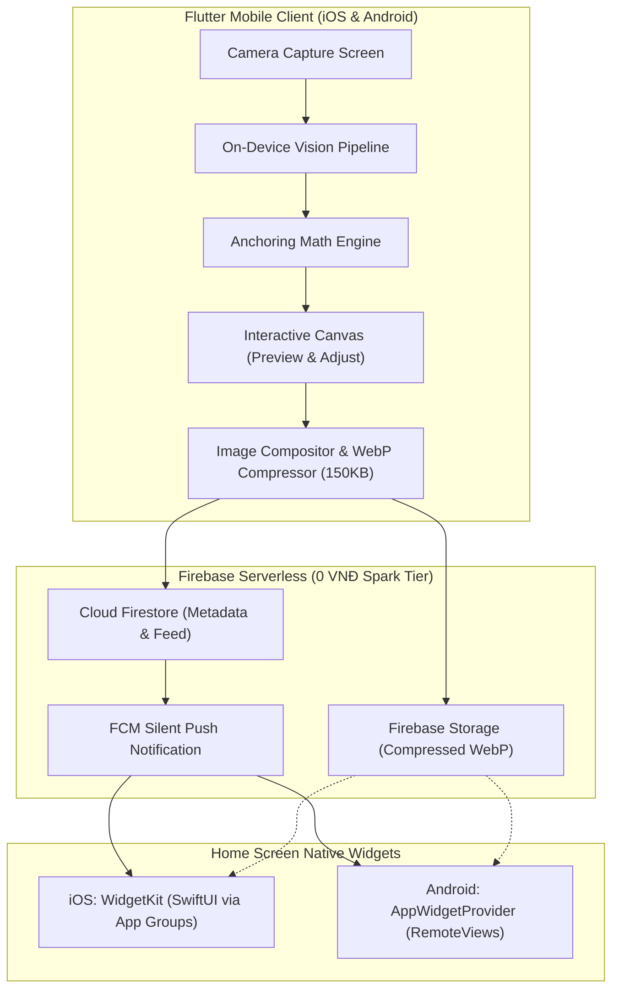

# Kiến Trúc Tổng Thể Hệ Thống (System Architecture) - ICNative

## 1. Tầm Nhìn & Mục Tiêu Kỹ Thuật
ICNative là ứng dụng chia sẻ khoảnh khắc hình ảnh lên màn hình chính (Home Screen Widget) của bạn bè theo thời gian thực (tương tự Locket), nhưng sở hữu tính năng đột phá: **Tự động nhận diện ngữ cảnh vật thể và neo dán meme/sticker tương tác theo mép vật thể (Contextual Snapping Meme)**.

### Ràng buộc then chốt:
* **Chi phí Server AI:** 0 VNĐ (Hoàn toàn không dùng Cloud Vision API như OpenAI/Gemini Cloud).
* **Độ trễ xử lý:** Dưới 500ms On-Device ngay sau khi chụp ảnh.
* **Chi phí Hạ tầng:** Tối ưu triệt để để chạy vĩnh viễn trên gói Firebase Free Tier (Spark Plan).

---

## 2. Sơ Đồ Khối Kiến Trúc (Architecture Diagram)

---

## 3. Các Phân Hệ Cốt Lõi

### 3.1. Phân Hệ Thị Giác Máy Tính On-Device (Vision & Geometry Pipeline)
Thay vì sử dụng các thuật toán OpenCV cổ điển vốn dễ bị nhiễu do vân bàn hay bóng đổ (semantic blindness), hoặc các mô hình Cloud đắt đỏ, ICNative sử dụng kiến trúc lai 2 tầng:
1. **Tầng 1 - Semantic Detection (Google ML Kit Object Detection & Image Labeling):**
   - Chạy trên TFLite tăng tốc phần cứng qua NPU (Neural Processing Unit).
   - Trả về Bounding Box và nhãn phân loại (Food, Drink, Plant, Animal...) trong ~35 - 50ms.
2. **Tầng 2 - Geometric ROI Refinement:**
   - Trích xuất vùng ảnh con (ROI) của vật thể.
   - Sử dụng thuật toán đạo hàm bậc nhất (Sobel gradient) hoặc Extreme Point Scan để định vị mép trên cùng (Apex) hoặc mép bên phải.
   - Tính toán góc tiếp tuyến (tangent angle $\theta$) tại điểm tiếp xúc.
3. **Tầng 3 - Anchoring Matrix:**
   - Căn chỉnh điểm neo của Meme (`bitePoint`) khớp tuyệt đối vào điểm mép của vật thể.

### 3.2. Phân Hệ Tối Ưu Hóa Băng Thông (Firebase Spark Plan 0 VNĐ)
* **Vấn đề:** Gói miễn phí Firebase Storage giới hạn tải về 1 GB/ngày. Nếu gửi ảnh 3MB camera gốc, hệ thống sẽ sập chỉ sau ~300 lần cập nhật widget.
* **Giải pháp của ICNative:**
  - Kích thước màn hình Widget chỉ cần tối đa `720x720` px.
  - Ngay tại thiết bị gửi, ảnh được hợp nhất (Original Photo + Sticker Overlay) và nén thành chuẩn **WebP (chất lượng 80)**.
  - Dung lượng mỗi ảnh chỉ còn khoảng **100KB - 150KB**.
  - **Khả năng chịu tải:** 1 GB / 150 KB $\approx$ **7.000 lượt cập nhật widget mỗi ngày** hoàn toàn miễn phí.

### 3.3. Phân Hệ Đồng Bộ Widget Native
* **iOS (WidgetKit):**
  - Sử dụng App Groups (`group.com.yourcompany.icnative`) để chia sẻ thư mục ảnh giữa Flutter App và Widget Extension.
  - Silent Push Notification (`content-available: 1`) đánh thức app tải ảnh mới ngầm và gọi `WidgetCenter.shared.reloadAllTimelines()`.
* **Android (AppWidgetProvider):**
  - Firebase Messaging Background Receiver tải ảnh về bộ nhớ cache cục bộ.
  - Dùng `home_widget` và `RemoteViews` để cập nhật Bitmap vào Widget ngay lập tức.
