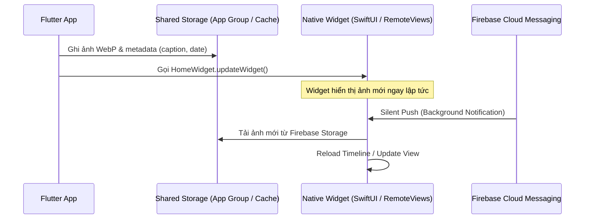

# Hướng Dẫn Tích Hợp Home Screen Widget - ICNative

Tài liệu này hướng dẫn chi tiết cách triển khai cập nhật ảnh lên Widget màn hình chính cho cả iOS (WidgetKit) và Android (AppWidgetProvider) sử dụng thư viện `home_widget`.

---

## 1. Kiến Trúc Chia Sẻ Dữ Liệu



---

## 2. Cấu Hình Phía iOS (WidgetKit & App Groups)

### 2.1. Thiết lập App Groups
1. Mở Xcode, chọn Runner Target -> **Signing & Capabilities** -> Bấm `+ Capability` -> Chọn **App Groups**.
2. Thêm group ID: `group.com.yourcompany.icnative`.
3. Tạo thêm một Widget Extension Target (ví dụ tên `ICNativeWidgetExtension`).
4. Thêm Capability **App Groups** cho Widget Target này với cùng ID `group.com.yourcompany.icnative`.

### 2.2. Mã nguồn SwiftUI Widget (Swift)
```swift
import WidgetKit
import SwiftUI

struct Provider: TimelineProvider {
    func getTimeline(in context: Context, completion: @escaping (Timeline<SimpleEntry>) -> ()) {
        let sharedDefaults = UserDefaults(suiteName: "group.com.yourcompany.icnative")
        let imagePath = sharedDefaults?.string(forKey: "widget_image_path")
        
        let entry = SimpleEntry(date: Date(), imagePath: imagePath)
        let timeline = Timeline(entries: [entry], policy: .atEnd)
        completion(timeline)
    }
    // ... snapshot & placeholder implementations
}

struct SimpleEntry: TimelineEntry {
    let date: Date
    let imagePath: String?
}

struct ICNativeWidgetEntryView : View {
    var entry: Provider.Entry

    var body: some View {
        if let path = entry.imagePath, let uiImage = UIImage(contentsOfFile: path) {
            Image(uiImage: uiImage)
                .resizable()
                .aspectRatio(contentMode: .fill)
        } else {
            Text("Chưa có ảnh mới")
        }
    }
}
```

---

## 3. Cấu Hình Phía Android (AppWidgetProvider & RemoteViews)

### 3.1. Khai báo Widget trong `AndroidManifest.xml`
```xml
<receiver android:name=".ICNativeWidgetProvider"
    android:exported="true">
    <intent-filter>
        <action android:name="android.appwidget.action.APPWIDGET_UPDATE" />
    </intent-filter>
    <meta-data
        android:name="android.appwidget.provider"
        android:resource="@xml/icnative_widget_info" />
</receiver>
```

### 3.2. Mã nguồn `ICNativeWidgetProvider.kt`
```kotlin
package com.yourcompany.icnative

import android.appwidget.AppWidgetManager
import android.content.Context
import android.graphics.BitmapFactory
import android.widget.RemoteViews
import es.antonborri.home_widget.HomeWidgetProvider

class ICNativeWidgetProvider : HomeWidgetProvider() {
    override fun onUpdate(
        context: Context,
        appWidgetManager: AppWidgetManager,
        appWidgetIds: IntArray,
        widgetData: android.content.SharedPreferences
    ) {
        appWidgetIds.forEach { widgetId ->
            val views = RemoteViews(context.packageName, R.layout.widget_layout).apply {
                val imagePath = widgetData.getString("widget_image_path", null)
                if (imagePath != null) {
                    val bitmap = BitmapFactory.decodeFile(imagePath)
                    setImageViewBitmap(R.id.widget_image, bitmap)
                }
            }
            appWidgetManager.updateAppWidget(widgetId, views)
        }
    }
}
```

---

## 4. Phía Flutter: Gọi Đồng Bộ với `home_widget`

```dart
import 'package:home_widget/home_widget.dart';

Future<void> updateHomeScreenWidget(String localWebPImagePath) async {
  // Ghi đường dẫn file vào shared storage
  await HomeWidget.saveWidgetData<String>('widget_image_path', localWebPImagePath);
  
  // Yêu cầu hệ điều hành reload widget UI
  await HomeWidget.updateWidget(
    name: 'ICNativeWidgetProvider',
    iOSName: 'ICNativeWidgetExtension',
  );
}
```
